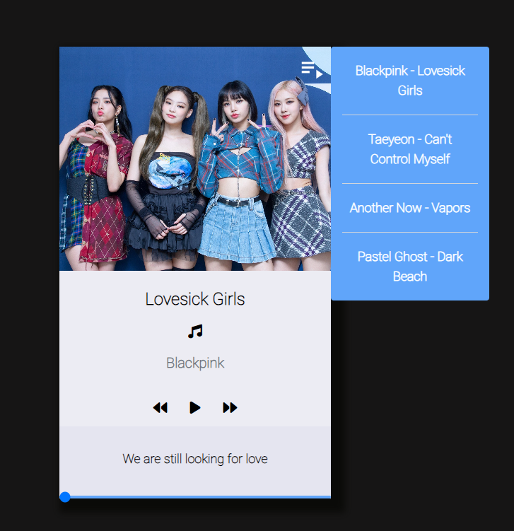

# Web Player App

A simple web player application built with HTML, CSS, and JavaScript. The app allows you to play and control music tracks, displaying details about the currently playing song and providing options to navigate through a playlist.

## Features

- Play/pause music.
- Skip to the next or previous song.
- Control the playback progress using a slider.
- View song details, including the song name, artist, and a quote.
- Toggle the playlist to view and select songs.

## Preview



## Getting Started

These instructions will help you get a copy of the project up and running on your local machine.

### Prerequisites

- Web browser (e.g., Google Chrome, Mozilla Firefox)

### Installation

1. Clone the repository:

   ``` 
   $ git clone https://github.com/LemonMantis5571/APP-Player-Web
    ```

## Usage

- Click the play/pause button (`▶️` or `⏸️`) to control the music playback.
- Use the forward (`⏭️`) and backward (`⏮️`) buttons to skip to the next or previous song in the playlist.
- Adjust the slider to change the playback progress of the current song.
- Click on a song in the playlist to load and play that song.

## Contributing

Contributions are welcome! If you find any issues or have suggestions for improvements, please create a new issue or submit a pull request.


## Acknowledgements

This project was inspired by the love for music and the desire to create a simple and functional web player. We would like to acknowledge the following resources for their valuable contributions:

- [Font Awesome](https://fontawesome.com/) - for the awesome icons used in the player controls.
- [Tailwind CSS](https://tailwindcss.com/) - for providing utility classes that helped style the player components.
- [Unsplash](https://unsplash.com/) - for providing high-quality artist images used in the player.
- [Freepik](https://www.freepik.com/) - for the background image used in the player.